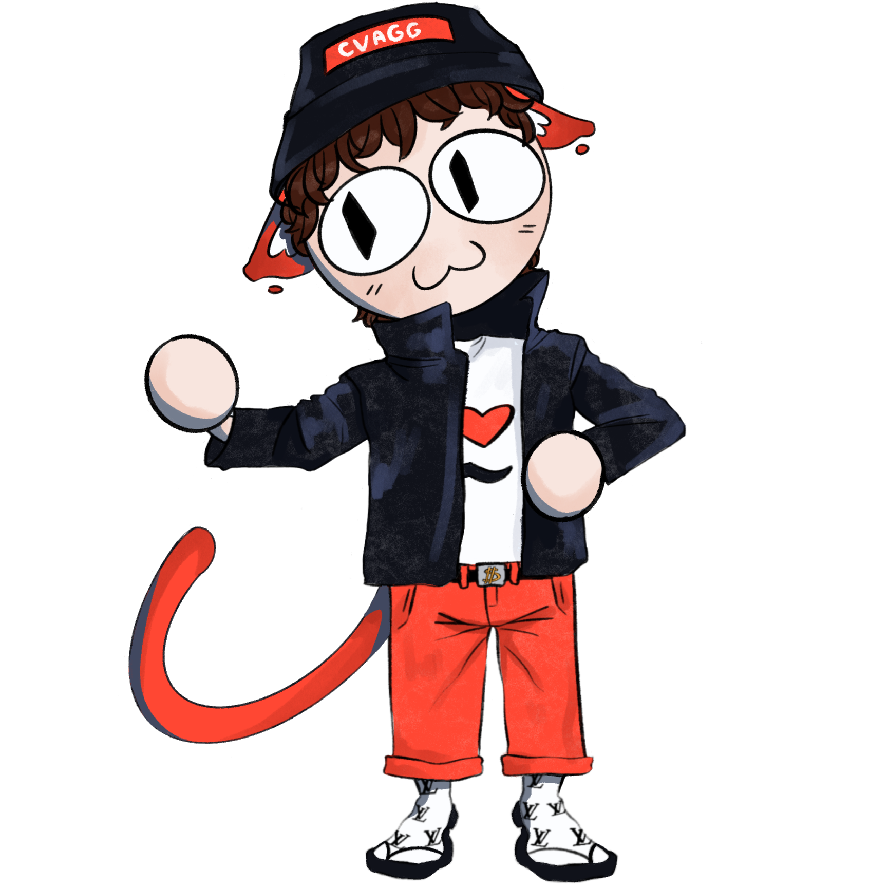

# CVagg
## О ПРОЕКТЕ

<table>
<tr>
<td width="65%">
  
**CVagg** - веб-приложение, которое помогает разработчикам быстро создавать, редактировать и хранить профессиональные резюме. Сервис автоматизирует рутину, предоставляет стильные шаблоны и использует AI для повышения качества резюме. Создавайте, анализируйте и экспортируйте резюме в один клик.

</td>
<td width="35%">

</td>
</tr>
</table>

 

## ОСОБЕННОСТИ

<ul>
	<li>
		🤖 <strong>ИИ-ассистент</strong>: Получайте мгновенную оценку своего резюме. ИИ анализирует структуру, формулировки и даёт советы по улучшению.
	</li>
	<li>
		📁 <strong>Множественные резюме</strong>: Создавайте, редактируйте и храните резюме для разных целей (фриланс, полноценная занятость, стажировка).
	</li>
	<li>
		🚀 <strong>Быстрый экспорт</strong>: Экспортируйте готовые резюме в формат PDF в пару кликов.
	</li>
	<li>
		🧩 <strong>Уютный интерфейс и дружелюбный ИИ</strong>: Мы сделали всё, чтобы работа над резюме не пугала. Ассистент говорит по-человечески и помогает расти, а не оценивает.
	</li>
</ul>

 

## ТЕХНОЛОГИИ

**Frontend:**  
    
**Backend:**  
  
**Database:**  
 
**Design:**  
 
**Tools:**  
   
**Ссылка на фигму**
https://www.figma.com/design/G6vf14E8DJfDqrZ3NmlERk/CVaggregator?node-id=0-1&t=zsmiti7xg13EQOCI-1  
 

## СТРУКТУРА РЕПОЗИТОРИЯ

📁 cvagg/ 
├── 📁 .github/&nbsp;&nbsp;&nbsp;&nbsp;&nbsp;&nbsp;&nbsp;&nbsp;&nbsp;&nbsp;&nbsp;&nbsp;&nbsp;&nbsp;&nbsp;&nbsp;&nbsp;&nbsp;&nbsp;&nbsp;&nbsp;# GitHub Actions и workflows 
├── 📁 backend/&nbsp;&nbsp;&nbsp;&nbsp;&nbsp;&nbsp;&nbsp;&nbsp;&nbsp;&nbsp;&nbsp;&nbsp;&nbsp;&nbsp;&nbsp;&nbsp;&nbsp;&nbsp;&nbsp;&nbsp;# Серверная часть (Go + Fiber) 
├── 📁 frontend/&nbsp;&nbsp;&nbsp;&nbsp;&nbsp;&nbsp;&nbsp;&nbsp;&nbsp;&nbsp;&nbsp;&nbsp;&nbsp;&nbsp;&nbsp;&nbsp;&nbsp;&nbsp;# Клиентская часть (React + TypeScript)  
├── 📁 images/&nbsp;&nbsp;&nbsp;&nbsp;&nbsp;&nbsp;&nbsp;&nbsp;&nbsp;&nbsp;&nbsp;&nbsp;&nbsp;&nbsp;&nbsp;&nbsp;&nbsp;&nbsp;&nbsp;&nbsp;&nbsp;# Изображения  
├── 📄 .gitignore&nbsp;&nbsp;&nbsp;&nbsp;&nbsp;&nbsp;&nbsp;&nbsp;&nbsp;&nbsp;&nbsp;&nbsp;&nbsp;&nbsp;&nbsp;&nbsp;&nbsp;&nbsp;&nbsp;# Игнорируемые Git файлы 
├── 📄 LICENSE&nbsp;&nbsp;&nbsp;&nbsp;&nbsp;&nbsp;&nbsp;&nbsp;&nbsp;&nbsp;&nbsp;&nbsp;&nbsp;&nbsp;&nbsp;&nbsp;&nbsp;&nbsp;&nbsp;&nbsp;&nbsp;&nbsp;# Лицензия 
├── 📄 README.md&nbsp;&nbsp;&nbsp;&nbsp;&nbsp;&nbsp;&nbsp;&nbsp;&nbsp;&nbsp;&nbsp;&nbsp;&nbsp;&nbsp;&nbsp;&nbsp;&nbsp;&nbsp;# Документация проекта 
└── 📄 docker-compose.yml&nbsp;&nbsp;&nbsp;&nbsp;&nbsp;&nbsp;&nbsp;&nbsp;&nbsp;# Docker Compose конфигурация

 

## КОМАНДА / КОНТАКТЫ

| Роль                 | Имя               | Контакт (Telegram)                 |
| -------------------- | ----------------- | ---------------------------------- |
| Backlead             | Андрей Хробостов  | @ansergoff                         |
| Frontlead, UI/UX     | Ирина Григорян    | @smokinblackdog                    |
| Backend              | Артём Голуб       | @Kekzuke                           |
| Backend              | Яков Бых          | @lobzikk_lobzikk                   |
| UI/UX Design         | Ирина Втюрина     | @blacktail69                       |
| Frontend             | Анастасия Исаева  | @cirrusghoulpro228                 |
| DevOps, тестирование | Николай Сидоренко | @xaxaxaxaxaxaxaxaxaxxaxxaxaxaxaxa  |

 

## Способ запуска

Перейти на наш сайт можно по ссылке https://cvagg.ru/ или запустить через **docker compose up --build**

 
 
 

	<em>to be continued...</em>

